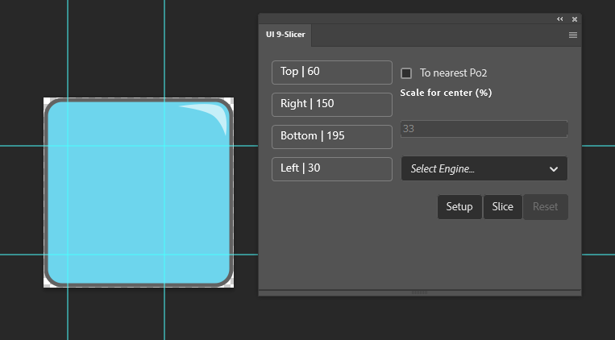
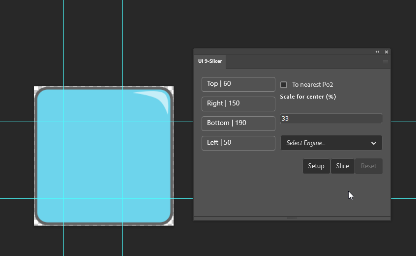
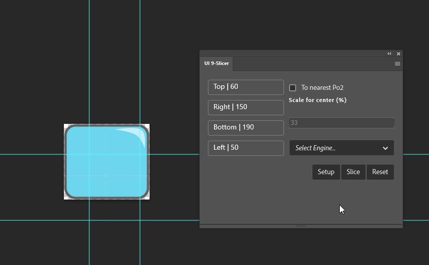

# UI 9 Slicer Photoshop plugin

This plugin is designed to speed up the process of 9-slicing a texture for UI game development. 

##Pre-built
You can find the pre-packaged version of the plugin at [package/ui.nine.slicer_PS](package). To package the plugin yourself follow the instructions at the bottom.
To install, just make sure you have Photoshop 2021 or above installed and double-click the plugin file.

##What is 9/Nine-slicing?

Nine slicing is the process of turning a big texture into a smaller one by shrinking the sides and center of the texture, retaining the corners.
So the texture can be stretched or tiled later in engine. This is used often in UI to save texture space/memory.

###Setup

Pressing the setup button will take the current selected layer, duplicate it into a new document, rasterize the layer and then trim the document.
Providing with a clean doc, move the generated guides to where the texture should be sliced. 

###Slice 
Pressing the slice button will execute the slice process. This will scale down the sides, move the corners and trim doc, the texture will then be ready to export.

###Reset
Pressing the reset button (it will be disabled when not applicable), will undo the changes to the sliced sprite and set it back to where the guides have been moved.
This allows for any adjustments if the slicing does not look correct.
---

###Settings

- **To nearest Po2:** Enabling this will ignore the scale for center and will try to get to the nearest power of 2 size below the current size. This is ideal for improving texture size in engine. If texture is going into an atlas this is less important but is recommended nonetheless.
- **Scale for center:** This will determine how much the center will decrease to (in %). This defaults to 33% if left unchanged, use this to get the lowest possible size.
- **Select Engine:** This will change the guides position number to correspond with the engine. Unreal uses a normal value (0-1), whilst Unity used absolute (0-TextureDimension)

#Development guide
## Loading in Photoshop
https://www.adobe.io/photoshop/uxp/guides/uxp-developer-tool/

You can load this plugin directly in Photoshop by using the UXP Developer Tools application. Once started, click "Add Plugin...", and navigate to the "manifest.json" file in this folder. Then click the ••• button next to the corresponding entry in the developer tools and click "Load". Switch over to Photoshop, and the plugin's panel will be running.

## Coding
- Use `npm install` to download the needed dev-dependencies. 
- This project used a mixture of Javascript and typescript, this is split up where the only manually made Javascript file is the Index.js everything else is Typescript
- Some files were automatically generated by the uxp-developer tool, these generally do not need to be touched (watch.sh, )
- This project used the standard code style https://standardjs.com

##Packaging
To package the plugin, you need to use the UXP Developer Tool. Click on the ••• button next to the entry in the developers tools and click Package". This will create a single file ready to distribute. Double clicking the file will get the user setup with the plugin thropugh Adobes Creative Service and can be disabled/uninstalled through that as well
